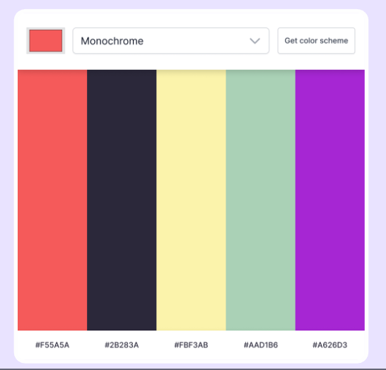

# 🎨 Color Scheme Generator

> A simple tool that helps users generate beautiful color palettes for their projects.

---

## 🪞 Overview
This project allows users to create and explore color combinations with ease. It’s designed for developers, designers, and anyone looking to quickly build aesthetic color palettes.

---

## 🚀 Features
- 🎛️ Select a seed color  
- 🎨 Generate 5-color palettes instantly  
- 🔄 Supports multiple color harmony modes  
- 📋 Copy hex color on click (optional feature)  
- ⚡ Fast and responsive  
- 🧩 Powered by **TheColorAPI**

---

## 🧱 Tech Stack
| Technology | Purpose |
|-----------|----------|
| **HTML5** | Structure |
| **CSS3** | Styling |
| **JavaScript (ES6)** | Logic & interactivity |

---

## 📚 What We Have Studied
- DOM selection & manipulation  
- Event listeners  
- Fetch API & Promises  
- Rendering dynamic HTML  
- JSON handling  
- Loading state management  

---

## 🌿 Lessons Learned
- Clean separation of logic using functions  
- How to integrate APIs into UI  
- Efficient rendering using template strings  
- Updating the UI after async operations  
- Better user experience with button disabling/loading  

---

## 🖼️ Screenshots / Demo

🔗 **Live Demo:** _Coming soon_

---

## 💫 Author
👩‍💻 **Created by Your Name**  
> _“Build. Break. Learn. Repeat.”_

